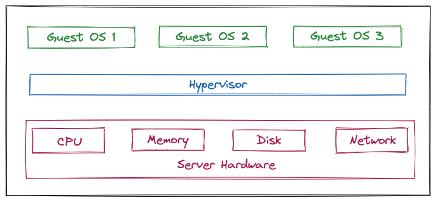
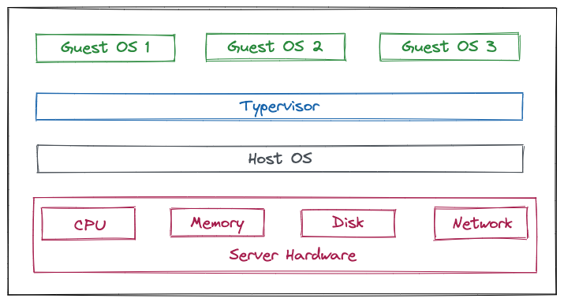

# 什么是虚拟化

虚拟化是一种技术，它可以够将物理计算机的工作能力分配给多个用户或环境，从而充分利用计算机的所有能力。

举一个实际例子，假设我们有3台物理服务器，分别用于不同的特定用途，分别用作部署数据库、后端服务和前端服务。每台服务器只使用了大约 30% 的硬件资源（CPU、内存、IO等），这仅是物理服务器运行潜能的一小部分。但是，借助虚拟化技术，我们可以将数据库服务器分割为多个能够处理其他任务的虚拟服务器，您仍然使用相同的硬件，但可以更加高效地利用这些资源。

物理机我们一般称为宿主机（Host），宿主机上面的虚拟机称为客户机（Guest）。

# 虚拟化的运作原理

一款名为 Hypervisor （虚拟机监控程序）的软件可有效分隔物理资源，并将这些资源分配给不同虚拟环境（也就是需要这些资源的任务）使用。虚拟机监控程序可能位于操作系统的顶层（例如在便携式计算机上），或者直接安装在硬件上（例如服务器），后者是大多数企业使用虚拟化的方式。虚拟机监控程序接管物理资源，并对它们进行划分，以便虚拟环境能够对其进行使用。

来自物理环境的资源根据需要进行分区后，会分配给很多虚拟环境使用。用户在虚拟环境（通常称为虚拟客户机或虚拟机）内部，能够与计算任务交互，并运行计算。虚拟机作为单个数据文件运行（一般被称为镜像）。就像任何数字文件，虚拟机可以从一台计算机迁移至另一台，可以在不同的计算机上打开，而且功能不受影响。

当虚拟环境正在运行时，如果用户或程序发出一条指令，请求来自物理环境的更多资源， 虚拟机监控程序就会将请求传递到物理系统并缓存更改，所有这些步骤都接近本机速度（特别是如果该请求来自基于 KVM，即基于内核的虚拟机的开源虚拟机监控程序）。

# 虚拟化的类型

根据 Hypervisor 的实现方式和所处的位置，虚拟化又分为两种：Type-1虚拟化和Type-2虚拟化。

## Type-1虚拟化

Hypervisor直接在物理机上运行，它被称为裸机虚拟化, 也被称为裸金属架构，它不必预先加载底层操作系统。通过直接访问底层硬件而无需其他软件(例如操作系统和设备驱动程序)，Type-1虚拟化被视为用于企业计算的***效、性能***的虚拟化方案。VMware ESXi、Microsoft Hyper-V服务器 和 KVM等都属于这个类型。

同时，管理程序直接在物理硬件上运行也非常安全，因为裸机虚拟机管理程序可避免操作系统通常存在的安全问题和漏洞。这可确保每个访客VM与恶意软件和活动保持逻辑隔离。

## Type-2虚拟化

Hypervisor通常安装在现有操作系统之上，它被称为托管虚拟化，也被称为宿主架构，因为它依赖于主机预先安装的操作系统来管理对CPU、内存、存储和网络资源的调用。VMware Fusion、Oracle VM VirtualBox、适用于x86的Oracle VM Server、Oracle Solaris Zones、Parallels 和 VMware Workstation 都属于这个类型。

